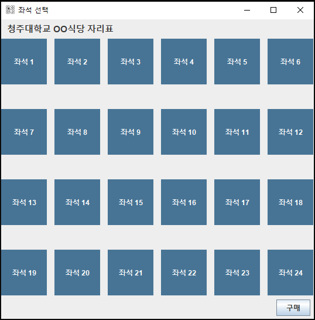
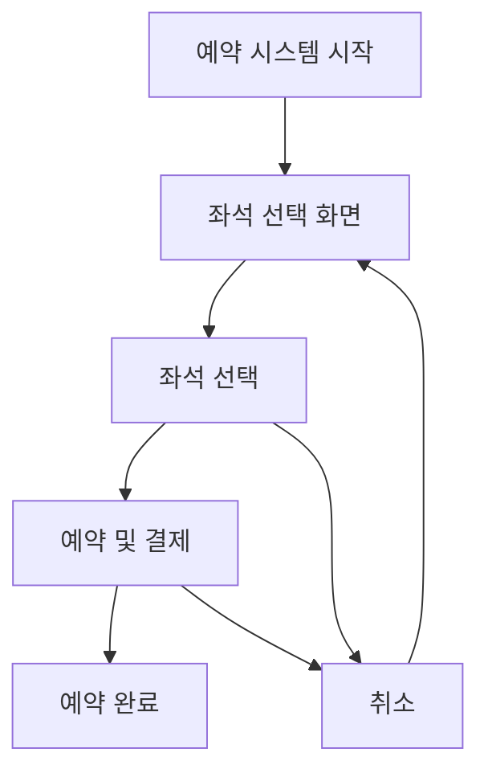

# School Cafeteria Seat Reservation
학교 급식 자리 예약 프로그램


## 목차
1. [개요](#개요)
   1. [목적](#1-목적)
   2. [대상](#2-대상)
   3. [스크린샷](#3-스크린샷)
2. [프로그램 소개](#프로그램의-중요성-및-필요성)
   1. [중요성](#1-중요성)
   2. [필요성](#2-필요성)
   3. [주요 기능 설명](#주요-기능-설명)
3. [프로그램 수행 절차](#프로그램-수행-절차)
   1. [절차 설명](#1-절차-설명)
   2. [다이어그램 (흐름도)](#2-다이어그램-흐름도)
   3. [클래스 다이어그램](#3-클래스-다이어그램)
4. [느낀 점](#느낀-점)
5. [기타](#기타)
   1. [향후 개발 계획](#향후-개발-계획)
   2. [설치 및 실행 방법](#설치-및-실행-방법)
   3. [기술 스택](#기술-스택)
   4. [문제 해결 (Troubleshooting)](#문제-해결-troubleshooting)
   5. [기여 방법](#기여-방법)
   6. [For International Contributors](#for-international-contributors)
6. [출처](#출처)


## 프로그램 소개

## 개요
### 1. 목적
학교 식당에서 **식권 구매와 동시에 좌석을 예약**할 수 있는 시스템입니다.  
학생들이 빈자리를 찾는 시간을 줄이고, 효율적인 식사 환경을 제공합니다.  
이를 통해 **혼잡한 식당 문제를 개선**하고, **사용자 만족도를 높이는** 것이 목표입니다.

---

### 2. 대상
이 프로그램의 대상은 학교 식당을 이용하는 모든 사람입니다.  
학생뿐 아니라, 주변 지역 주민 등 외부 방문객도 포함됩니다.   
하지만, 시간 관계상 만들면서 현재는 가장 중요한 학생만 구현하였습니다.
- **학생**
- 교직원 (추후 개발 예정)
- 외부 방문객 (추후 개발 예정)
- 주변 지역 주민 (추후 개발 예정)

---

### 3. 스크린샷

| 기능    | 이미지                                            |
|-------|------------------------------------------------|
| 메인 화면 |   |
| 구매 화면 |   |
| 결과 화면 |   |

## 프로그램의 중요성 및 필요성
### 1. 중요성
- **효율적인 시간 관리**  
   점심시간은 학생들에게 식사와 휴식을 위한 소중한 시간입니다.  
   좌석 예약 시스템으로 식사 대기 시간을 줄여 학업과 휴식에 더 많은 시간을 쓸 수 있습니다.


- **식당 운영의 체계화**  
   실시간 예약 현황을 통해 이용객 수를 미리 파악할 수 있어 식당 운영이 한결 수월해집니다.  
   또한, 좌석 현황을 한눈에 확인할 수 있어 붐비는 시간대도 효과적으로 관리할 수 있습니다.


- **고객 만족도 향상**  
   학생, 교직원, 방문객 모두가 편하게 식사할 수 있는 환경을 만듭니다.  
   원하는 자리에서 대기 없이 식사할 수 있어 이용자들의 만족도가 높아질 것입니다.


- **공정한 좌석 이용**  
   선착순이나 무질서한 자리 배정에서 벗어나,   
   체계적인 예약 시스템으로 누구나 공평하게 좌석을 이용할 수 있습니다.

---

### 2. 필요성
- **혼잡한 식당 문제 해결**  
  인기 있는 시간대의 식당 혼잡은 학생들에게 스트레스를 주고, 귀중한 시간을 낭비하게 만듭니다.  
  좌석 예약 시스템은 이런 문제를 해결해 식당의 효율적 이용을 돕습니다.


- **다양한 이용자 요구 충족**  
  학교뿐만 아니라 지역 주민과 같은 외부 방문객도 식당을 이용하는 경우가 많습니다.  
  예약 시스템은 이러한 다양한 사용자층의 요구를 충족시키며, 더 많은 사람이 식당을 편리하게 이용할 수 있게 합니다.


- **디지털 환경 적응**  
  대부분의 학생들은 스마트폰과 같은 디지털 기기를 적극적으로 활용하고 있습니다.  
  이러한 기술적 기반을 활용한 좌석 예약 시스템은 학생들에게 친숙하며, 사용자 경험을 향상시킬 수 있습니다.


- **공간 자원의 효율적 활용**  
  좌석 예약 데이터를 분석하면, 특정 시간대에 비어 있는 좌석을 파악하거나, 부족한 좌석 수를 확인하여 운영 방안을 개선할 수 있습니다.  
  이는 식당 공간을 최대한 효율적으로 사용하는 데 기여할 것입니다. 

---

### 주요 기능 설명
#### 1. 좌석 예약
- 실시간 좌석 현황 확인
- 다중 좌석 선택 기능
- 예약 확인 및 취소

#### 2. 결제 시스템
- 선택한 좌석 가격 자동 계산
- 결제 내역 확인
- 영수증 발급

#### 3. 데이터 관리
- JSON 형식으로 좌석 데이터 저장
- 예약 정보 실시간 업데이트
- 데이터 백업 및 복구


## 프로그램 수행 절차
### 1. 절차 설명
클래스 다이어그램과 구조를 바탕으로 **좌석 예약 프로그램**의 절차를 설명합니다.

1. **프로그램 실행 (Index 클래스)**
    - 프로그램 진입점인 `main()` 메서드를 실행합니다.
    - `BasicsFrame` 객체가 생성되어 전체 프레임이 화면에 표시됩니다.

2. **기본 프레임 설정 (BasicsFrame 클래스)**
    - `BasicsFrame` 클래스는 전체 UI 화면을 설정합니다.
    - `MakeBtn`, `SelectBtn`, `SeatDataManager` 객체가 생성됩니다.
    - 화면에는 `northPanel`, `mainPanel`, `southPanel`과 같은 레이아웃 영역이 설정됩니다.

3. **좌석 버튼 선택 (SelectBtn 클래스)**
    - 사용자(고객)는 `SelectBtn`을 클릭하여 좌석을 선택합니다.
    - `SelectedBtnAction`이 `actionPerformed()`를 실행해 선택된 버튼 정보를 `selectedButtons`에 저장합니다.
    - 선택된 좌석 정보는 `SeatDataManager`에 반영됩니다.

4. **구매 버튼 동작 (BuyBtn 클래스, BuyTicketAction 클래스)**
    - `BuyBtn` 클릭 시, `BuyTicketAction`의 `actionPerformed()`가 호출됩니다.
    - `checkBtnText()` 메서드를 통해 좌석이 선택되었는지 확인합니다.
    - `purchaseSeats()`를 호출하여 좌석 구매를 처리합니다.

5. **데이터 관리 (SeatDataManager 클래스)**
    - `SeatDataManager`는 선택된 좌석 데이터를 `seatMap`에 저장하거나 불러옵니다.
    - `loadSeatData()`, `saveSeatData()` 메서드를 통해 JSON 형식으로 데이터가 파일에 저장됩니다.

6. **결과 출력 및 화면 갱신 (PurchaseFrame 클래스)**
    - 좌석 구매가 완료되면 `PurchaseFrame`이 생성됩니다.
    - 결과 패널과 버튼들이 화면에 표시되며 사용자에게 구매 결과를 보여줍니다.
    - 필요 시 `cancelBtn`으로 작업을 취소하거나 다시 초기 화면으로 돌아갑니다.

---

### 2. 다이어그램 (흐름도)

아래 흐름도는 프로그램의 수행 절차를 단계별로 시각화한 것입니다.


---
### 3. 클래스 다이어그램

아래 흐름도는 프로그램의 클래스 다이어그램을 시각화한 것입니다.


## 느낀 점
이번에 프로그램을 만들면서 설계 부분에서 많은 생각이 들었습니다.   
제가 만드는 프로그램을 다른 사람에게 완전한 프로그램이 아닌 저의 핵심 기능을 보여주는 프로토타입으로 만들었고,  
최대한 나의 중요한 기능에 대해서 우선순위를 정해서 하나씩 기능을 만들어 갔습니다.
### 1. 설계의 중요성
설계라는 작업을 많이 해보지 않아서 설계의 시간에서 많은 시간을 소요해 걱정이 되었습니다.  
하지만, 코드를 작성하는 시간보다 설계하는 시간이 중요하다고 우선순위를 이미 정하였기에 저는 제가 정한 기준에 따라 최선을 다하기 위해서 설계를 마쳤습니다.  
그리고 경로를 설정하고 파일을 만들어서 코드를 작성하는데 큰 시간이 소요되지 않았음을 느꼈습니다.  
제가 설계하는 시간이 정말 오래 걸려서 인지 코드를 작성하는 시간은 너무나도 짧았습니다.  
수업 시간에 항상 설계가 중요하다는 것은 머리로 이해하고 있었습니다.  
이번에 처음으로 설계가 너무나도 중요하다는 것을 머리로 이해하는 것이 아닌 몸소 느껴서 앞으로의 설계를 짤 때 어떻게 더 효율적이고, 체계적으로 설계할지 생각이 넘치고, 해보고 싶은 설계도 많아졌습니다.
설계에 있어서 너무 어렵게만 생각했었는데 당연한 흐름이 눈에 보이면 구조를 짤 때에도 쉽게 짤 수 있다는 것을 깨달았습니다.  
그리고 이번 프로젝트를 통해 사용자 중심 설계의 중요성을 깊이 이해하게 되었습니다.    
처음에는 단순히 기능 구현에만 집중했지만, 실제 학생들이 어떻게 사용할지 고민과 피드백을 받으면서 UI/UX의 중요성을 깨달았습니다.  
이러한 경험을 통해 기술적 완성도뿐만 아니라 사용자 경험이 프로젝트의 성공을 좌우한다는 것을 배웠습니다.

### 2. 백업의 중요성
제가 코드를 빌드하는 작업에서 실수를 하는 바람에 프로젝트를 다시 복구하는 과정이 있었는데 백업을 해놓지 않아서 프로젝트가 날아갔습니다.  
그래서 커밋했던 기록이 사라져 대략 20개 정도의 커밋 수가 초기화 되었습니다.  
이번에 프로젝트를 만들면서 혼자 하더라도 브랜치를 파서 테스트를 하는 브랜치와 백업을 해놓은 브랜치 하나씩 만들어서 제가 작업 중에 실수를 해도 처리할 수 있게 하는 방법을 사용해야한다는 점을 깨달았습니다.
  
 
## 기타

### 향후 개발 계획
#### 1단계
- 교직원 전용 예약 시스템 구현
- 결제 시스템 고도화

#### 2단계
- 외부 방문객 예약 시스템 추가
- 실시간 알림 서비스 구현
- 통계 분석 기능 추가

### 설치 및 실행 방법
#### 필요 환경
- Java JDK 17 이상
- Gradle 7.0 이상
- IDE: IntelliJ IDEA 또는 Eclipse

#### 설치 단계
1. 리포지토리 클론
```bash
git clone https://github.com/Jiu125/SeatReservation.git
cd SeatReservation
```

2. 프로젝트 빌드
```bash
gradle build
```

3. 프로그램 실행
```bash
gradle run
```

### 기술 스택
- **언어:** Java 17
- **데이터 처리:** Gson
- **빌드 도구:** Gradle
- **버전 관리:** Git

### 문제 해결 (Troubleshooting)
#### 자주 발생하는 문제
1. **프로그램이 실행되지 않을 때**
    - Java 버전 확인
    - 필요한 라이브러리 설치 여부 확인

2. **데이터가 저장되지 않을 때**
    - 파일 권한 확인
    - JSON 파일 경로 확인


### 기여 방법
1. 리포지토리를 포크(Fork)합니다
2. 작업할 브랜치를 생성합니다 (git checkout -b feature/새로운기능)
3. 변경사항을 커밋합니다 (git commit -m '새로운 기능 추가')
4. 브랜치에 푸시합니다 (git push origin feature/새로운기능)
5. Pull Request를 생성합니다

### For International Contributors
1. Fork the repository
2. Create your feature branch (`git checkout -b feature/AmazingFeature`)
3. Commit your changes (`git commit -m 'Add some AmazingFeature'`)
4. Push to the branch (`git push origin feature/AmazingFeature`)
5. Open a Pull Request

## 출처

  ```
  @software{2023011794_SeatReservation},
    author = {Jiwoo, Park},
    title = {SeatReservation},
    year = {2024},
    publisher = {GitHub},
    journal = {GitHub repository},
    howpublished = {\url{https://github.com/Jiu125/SeatReservation},
  }
  ```